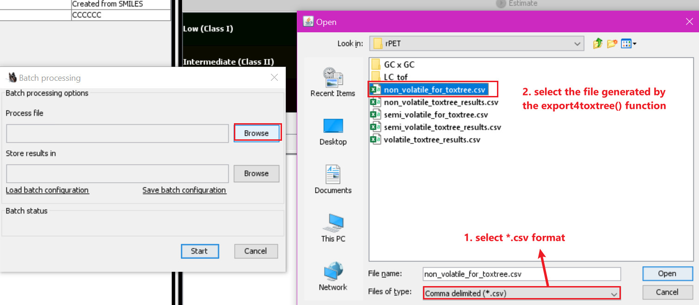

<!-- README.md is generated from README.Rmd. Please edit that file -->

```{r, include = FALSE}
knitr::opts_chunk$set(
  collapse = TRUE,
  comment = "#>",
  fig.path = "man/figures/README-",
  out.width = "100%",
  eval = FALSE
)
```

# fcmsafety

<!-- badges: start -->
<!-- badges: end -->

  The goal of fcmsafety is to assign toxicity levels for compounds from food contact 
  materials. It takes into account the toxicity data from:
  1. Substances of Very High Concern (SVHC) from ECHA (https://echa.europa.eu/candidate-list-table);
  2. Carcinogenic, Mutagenic, and Reprotoxic (CMR) from the Classification,
  Labelling, and Packaging (CLP) regulation (https://echa.europa.eu/information-on-chemicals/annex-vi-to-clp) ;
  3. Carcinogenic substances from IARC (https://monographs.iarc.who.int/list-of-classifications);
  4. Endocrine Disrupting Chemicals (EDC) from The International Panel on 
  Chemical Pollution (IPCP) commissioned by UN Environment (https://www.unep.org/explore-topics/chemicals-waste/what-we-do/emerging-issues/scientific-knowledge-endocrine-disrupting);
  5. Specific Migration Limit (SML) from EU 10/2011 regulation (https://eur-lex.europa.eu/legal-content/EN/TXT/HTML/?uri=CELEX:02011R0010-20200923&qid=1636402301680&from=en)
  6. Specific Migration Limit (SML) from China GB 9685 regulation (Provided by 
  IQTC). 
    
  The toxicity level assignment follows the rules listed in the inst/toxicity_levels.png
  (don't know why it is not rendered in this readme file)
    
  Please bear in mind that the toxicity level assignment here is on the basis of 
  individual compounds, whilst substances listed in the aforementioned databases
  could be groups of compounds. These groups of substances will not be considered
  as they not are specific in terms of chemical structures and no "InChIKey" can 
  be retrieved from Pubchem, which is used for matching. For example, nonylphenols
  are a family of closely related organic compounds composed of phenol bearing
  a 9 carbon-tail, and they could be overlooked unless any database has numerated 
  some specific structures in their lists. 
  
  In addition, this package provides simple wrappers of some functions from
  the **webchem** and **classyfireR** package to ease CID, InChIKey, SMILES, 
  Formula, ExactMass, CAS, flavonet, and classifire information retrieval.
  
## Release notes (2021.11.24 Version 0.1.2)
### Enhancement

1. extract_cid() now support any of the following keys, "InChIKey", "CAS", 
or "Name", as well as their combinations. 
2. Add a default value to the cas_col argument in evaluate_compound().


### Bug fixes

1. evaluate_compound() "Error: Argument 1 must have names." error fixed.
2. Remove duplicates results if you have duplicate InChIKey values.
3. Remove warnings when load_databases().

### Others

1. Retrieval CAS number in the extract_meta() function instead of in evaluate_compound().


## Installation

You can install the development version of fcmsafety from [GitHub](https://github.com/) 
with the code listed below. If you have installed the package before the date 
listed in *Release Notes*, please re-install it to ensure to have the latest version.

```{r}
install.packages("devtools")
devtools::install_github("QizhiSu/fcmsafety")
```
If you fail to install it due to the classyfireR issue, please install classyfireR
first.

```{r}
devtools::install_github('aberHRML/classyfireR')
```

## How to use?

Below walks you through the way to go step by step. 

If you do not have the "rio" and "dplyr" package installed, please install it first. 
If you do, just skip this step.

```{r}
install.packages("rio")
install.packages("dplyr")
```

### Load required packages
```{r}
library(fcmsafety)
library(dplyr)
```

### Update and Load databases
You have to first update all the databases and load them into the global environment. 
```{r}
# You don't have to update all the databases as we have prepared them (updated 
# on 2021/11/11) and can be used directly. In case you want to have the latest 
# databases (if you find any update of these databases after 2021/11/11), please
# run update_databases(), it might take long time as retrieving meta data for 
# all these databases is time-consuming.
update_databases()

# If you have updated the databases yourself, please run:
load_databases(use_default = FALSE)
# Otherwise
load_databases()
```

### Process your data
1.  Read in your data

Please name your file in English but not Chinese (Chinese letters are not well 
supported in some functions). There should be at least one
column in your data containing either chemical names in English, CAS number, or 
InChIKey. The program will use any or all of these columns to retrieve meta data 
from Pubchem. A good chemical name is always favorable.
```{r}
# Please enter the path of your data, e.g., "D:/my data/mydata.xlsx".
data <- rio::import("D:/my data/mydata.xlsx")
```

2. Extract cid and meta data

Please specify which column contains CAS number by the "cas_col" argument, 
InChIKey by "inchikey_col", and chemical name by the "name_col" argument. You 
can also specify all these arguments. In this case, it will first use InChIKey, 
and then CAS and Name. On the default setting, CAS number, which is mandatory
if you want to extract flavonet information in the evaluate_compound() function,
will be extracted as well in the extract_meta() function. If you don't need it,
please set extract_meta(cas = FALSE). Depends on the size of your data, it might
take long time.
```{r}
data <- data %>% extract_cid(name_col = 1) %>% extract_meta()
```

3. Export file for Toxtree

For compounds that do not present in any of the databases we consider here, we 
can use Toxtree (http://toxtree.sourceforge.net/) to predict its Cramer rules
level which will be used for assigning toxicity level in the following step. 
We now can export a file that can be used by Toxtree for batch processing. 
```{r}
# This code will generate a file name "for_toxtree.csv"
export4toxtree(data, cas_col = 1, name_col = 2)
# Of course, you can also specify the path and name of the output file
export4toxtree(data, cas_col = 1, name_col = 2, output = "D:/data/mydata_for_toxtree.csv")
```

4. Toxtree batch processing

    {width=500px}
    
    {width=500px}
    
    {width=500px}
    

Normally, this step is quite fast, but we noticed that polyethylene glycols might
take quite long time.
    
5. Assign toxicity, get flavornet and classyfire information

This step requires the results from Toxtree (assuming you have the result in 
"D:/data/mydata_toxtree_results.csv"). On the default settings, flavornet and 
classyfire information are included, which is more time-consuming depends on the
size of your data. The CAS number containing column is automatically calculated
if you follow the above mentioned step (extract_cid() %>% extract_meta()).
Otherwise, you need to specify it by the "cas_col" argument. 
```{r}
data_complete <- data %>% 
  evaluate_compound(toxtree_result = "D:/data/mydata_toxtree_results.csv")
# If you don't need flavonet and classyfire information. In addition, for 
# flavonet = TRUE, cas = TRUE is required as flavornet information retrieval 
# is based on CAS number assuming you don't have complete CAS number.
data_complete <- data %>% 
  evaluate_compound(toxtree_result = "D:/data/mydata_toxtree_results.csv",
                    cas = FALSE, flavornet = FALSE, classyfire = FALSE)
```

6. Export results
```{r}
rio::export(data_complete, "D:/data/mydata_result.xlsx")
```

