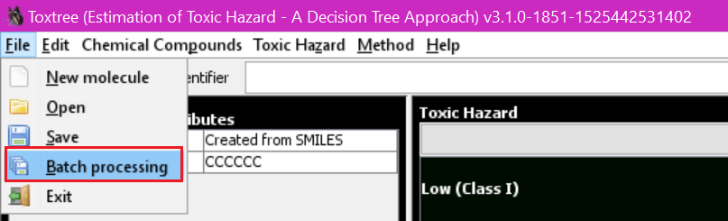
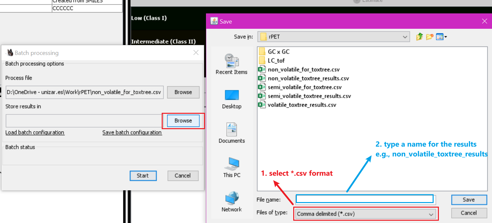

<!-- README.md is generated from README.Rmd. Please edit that file -->

# fcmsafety

<!-- badges: start -->
<!-- badges: end -->

The goal of fcmsafety is to evaluate the safety of compounds from food
contact materials. It takes into account the toxicity data from ECHA’s
Substances of Very High Concern (SVHC), Carcinogenic, Mutagenic, and
Reprotoxic (CMR) from the Classification, Labelling, and Packaging (CLP)
regulation, Carcinogenic substances from IARC, Endocrine Disrupting
Chemicals (EDC) from The International Panel on Chemical Pollution
(IPCP) commissioned by UN Environment, Specific Migration Limit (SML)
from both EU 10/2011 and China GB 9685 regulation. In addition, flavonet
and classifire information retrieval are integrates well.

## Installation

You can install the development version of fcmsafety from
[GitHub](https://github.com/) with:

``` r
install.packages("devtools")
devtools::install_github("QizhiSu/fcmsafety")
```

## How to use?

Below walks you through the way to go step by step.

You do not have the “rio” and “dplyr” package installed, please install
it first. If you do, just skip this step.

``` r
install.packages("rio")
install.packages("dplyr")
```

### Load required packages

``` r
library(fcmsafety)
library(dplyr)
```

### Update and Load databases

You have to first update all the databases and load them into the global
environment.

``` r
# You don't have to update all the databases as we have prepared them (updated 
# on 2021/11/11) and can be used directly. In case you want to have the latest 
# databases (if you find any update of these database after 2021/11/11), please
# run, if might take long time as retrieving meta data for all these databases
# is time-consuming.
update_databases()

# If you have updated the databases yourself, please run:
load_databases(use_default = FALSE)
# Otherwise
load_databases()
```

### Process your data

\#\#\#\#1. Read in your data

Please name your file in English but not Chinese. There should be at
least two column in your data. One contains chemical names in English,
another one includes CAS number. The program will first use CAS and then
chemical name to retrieve meta data from Pubchem. A good chemical name
is always favorable but CAS number is not mandatory.

``` r
# Please enter the absolute path of your data, e.g., "D/my data/mydata.xlsx".
data <- rio::import("mydata.xlsx")
```

\#\#\#\#2. Extract cid and meta data

Please specify which column contains CAS number by the “cas\_col”
argument, and chemical name by the “name\_col” argument. If you have
InChIKey column, you can also specify it by “inchikey\_col”.

``` r
data <- data %>% extract_cid(cas_col = 1, name_col = 2) %>% extract_meta()
```

\#\#\#\#3. Export file for Toxtree

For compounds that do not present in any of the databases we consider,
we can use Toxtree (<http://toxtree.sourceforge.net/>) to predict its
Cramer rules level. We now can export a file that can be used by Toxtree
for batch processing.

``` r
# This code will generate a file name "for_toxtree.csv"
export4toxtree(data, cas_col = 1, name_col = 2)
# Of course, you can also specify the path and name of the output file
export4toxtree(data, cas_col = 1, name_col = 2, output = "D:/data/mydata_for_toxtree.csv")
```

\#\#\#\#4. Toxtree batch processing

    {width=500px}
    {width=500px}
    {width=500px}
    Normally, this step is quite fast, but we noticed that polyethylene glycols might
    take quite long time.

\#\#\#\#5. Assign toxicity, get flavornet and classyfire information

This step requires the results from Toxtree (assuming you have the
result in “D:/data/mydata\_toxtree\_results.csv”). On the default
settings, flavornet and classyfire information are included, which is
more time-consuming depends on the size of your data.

``` r
data_complete <- data %>% 
  evaluate_compound(toxtree_result = "D:/data/mydata_toxtree_results.csv")
# If you don't need flavonet and classyfire information. In addition, for 
# flavonet = TRUE, cas = TRUE is required as flavornet information retrieval 
# is based on CAS number assuming you don't have complete CAS number.
data_complete <- data %>% 
  evaluate_compound(toxtree_result = "D:/data/mydata_toxtree_results.csv",
                    cas = FALSE, flavornet = FALSE, classyfire = FALSE)
```

\#\#\#\#6. Export results

``` r
rio::export(data_complete, "D:/data/mydata_result.xlsx")
```
